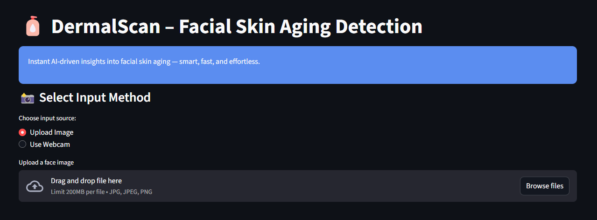

🧴 AI DermaScan – Facial Skin Aging Detection System

AI DermaScan is an AI-powered facial skin analysis application that evaluates facial images to identify visible skin aging conditions using deep learning and computer vision techniques.
The system is designed as an interactive web application built with Streamlit.

## 📸 Project Screenshot

  

📸 Project Preview

Upload facial images or use a webcam

Detect faces and analyze visible skin conditions

Visualize confidence distribution

Download detailed prediction reports (PDF)

✨ Features

Facial skin condition classification using deep learning

Supported skin categories:

Wrinkles

Dark Spots

Puffy Eyes

Clear Skin

Face detection using Haar Cascade

Supports:

Image upload

Webcam capture

Multi-face detection in group images

Confidence distribution visualization (bar charts)

Prediction logs with timestamps

Downloadable PDF report generation

Interactive and user-friendly Streamlit UI

🧠 Model & Approach

Base Model: EfficientNetB0 (pretrained on ImageNet)

Technique: Transfer Learning

Input Image Size: 224 × 224

Output: Softmax probabilities across 4 skin condition classes

🛠️ Tech Stack

Machine Learning: TensorFlow, Keras

Computer Vision: OpenCV

Frontend: Streamlit

Data Handling: NumPy, Pandas

Language: Python

📁 Project Structure

AI_DermaScan/
├── app.py                     # Streamlit application
├── train_model.py             # Model training script
├── predict_face.py            # Face prediction logic
├── save_prediction.py         # Logging and report utilities
├── best_balanced_noaug.keras  # Trained model
├── haarcascade_frontalface_default.xml
├── dataset/                   # Sample dataset
├── predictions.csv            # Prediction logs
├── requirements.txt           # Dependencies
└── README.md                  # Project documentation

📊 Dataset

Facial images categorized into:

Wrinkles

Dark Spots

Puffy Eyes

Clear Skin

Dataset used for training was obtained from a collaborator.

Due to size constraints, only sample data is included in this repository.

🚀 Installation & Usage
1️⃣ Clone the repository
git clone https://github.com/<UTKARSH-TYAGI-1247>/AI_DermaScan.git
cd AI_DermaScan

2️⃣ Create a virtual environment
python -m venv venv
venv\Scripts\activate

3️⃣ Install dependencies
pip install -r requirements.txt

4️⃣ Run the application
streamlit run app.py

🔮 Future Improvements

Improve face detection using advanced deep learning-based detectors

Add skin condition severity scoring

Enhance UI with richer visual analytics

Deploy application on Streamlit Cloud

👨‍💻 Author

Utkarsh Tyagi
B.Tech (Information Technology)
Internship Project

🔗 Repository

Forked from mentor-provided repository for academic submission.